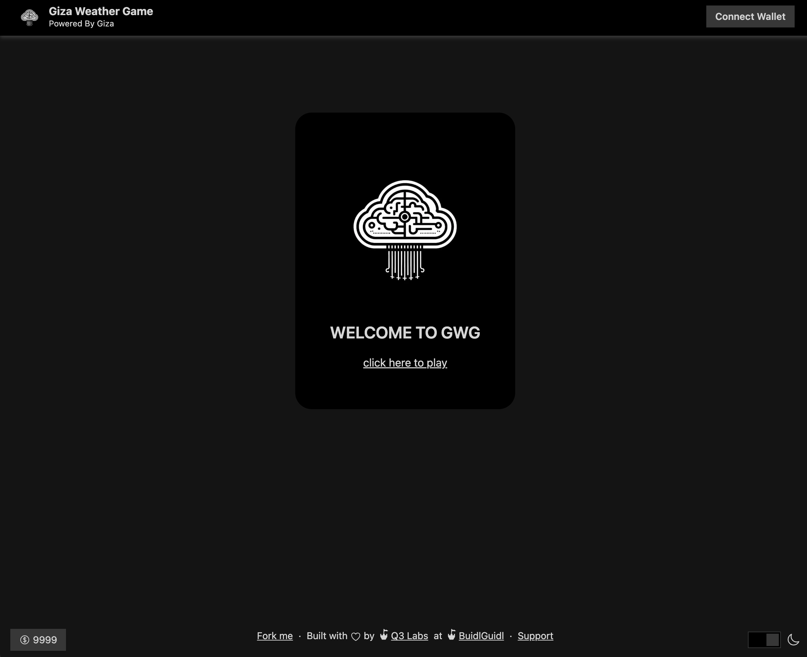
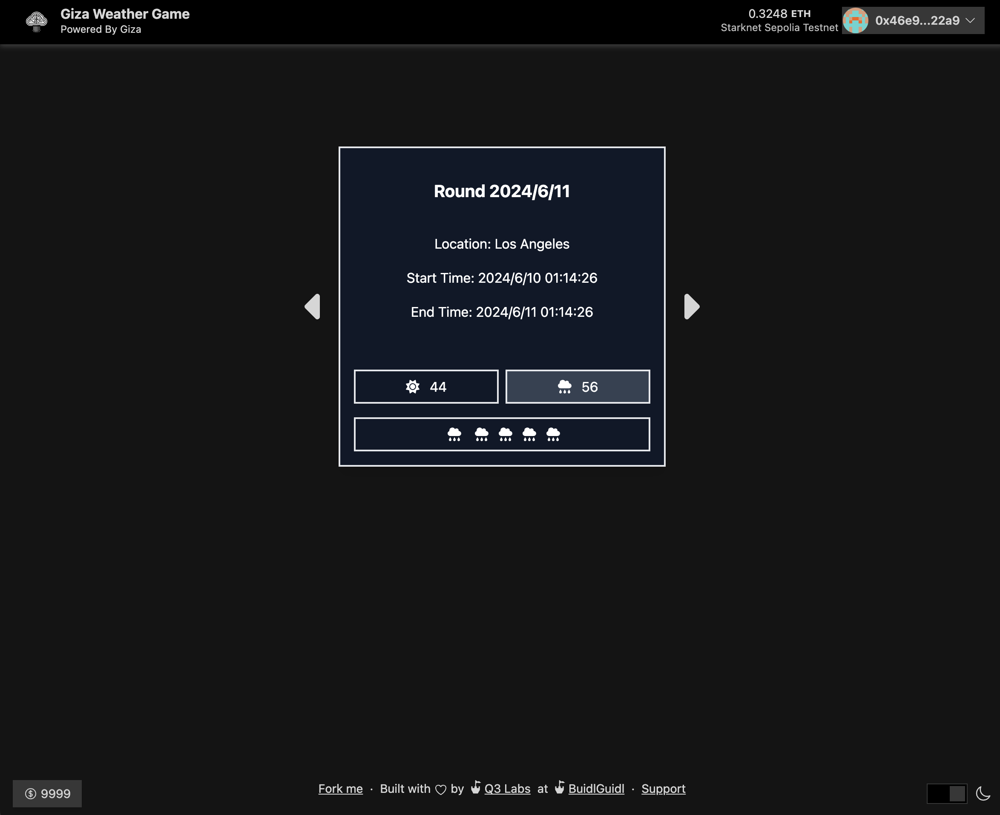

# Giza-Weather-Game
Giza Weather Game, inspired by Giza and WeatherXM, uses historical weather data and time series machine learning to predict future weather. The model will be deployed on the zkml platform Giza. With Giza AI Agent, offering daily weather predictions and betting options.

- website demo starknet version: <https://nextjs-yyczs-projects.vercel.app/>
- website demo evm version: <https://gwg-frontend.vercel.app/>





## General Process
1. fetch raw weather data from [WeatherXM Data Index](https://index.weatherxm.network/), organize and clean data and get [Processed Data(WeatherXMData.csv)](WeatherXMData.csv) and prepare for training.

2. Create and Train an XGBoost Model, Save the [XGBoost Model](train_xgboost.py).  `python train_xgboost.py`

3. - Transpile model to Orion Cairo and deploy it on Giza platform.

      ```
      >>> giza transpile xgb_weather.json --output-path xgb_weather

      [giza][2024-06-01 03:47:17.251] No model id provided, checking if model exists ✅ 
      [giza][2024-06-01 03:47:17.253] Model name is: xgb_weather
      [giza][2024-06-01 03:47:18.773] Model already exists, using existing model ✅ 
      [giza][2024-06-01 03:47:18.775] Model found with id -> 675! ✅
      [giza][2024-06-01 03:47:20.103] Version Created with id -> 4! ✅
      [giza][2024-06-01 03:47:20.105] Sending model for transpilation ✅ 
      [giza][2024-06-01 03:47:36.077] Transpilation is fully compatible. Version compiled and Sierra is saved at Giza ✅
      [giza][2024-06-01 03:47:38.093] Downloading model ✅
      [giza][2024-06-01 03:47:38.099] model saved at: xgb_weather

      >>> giza endpoints list
      >>> giza endpoints get --endpoint-id 1

      >>> giza endpoints deploy --model-id 675 --version-id 4
      ▰▰▰▰▰▰▱ Creating endpoint!
      [giza][2024-06-01 04:36:19.718] Endpoint is successful ✅
      [giza][2024-06-01 04:36:19.720] Endpoint created with id -> 244 ✅
      [giza][2024-06-01 04:36:19.721] Endpoint created with endpoint URL: https://endpoint-yycztest-675-4-ba8264e2-7i3yxzspbq-ew.a.run.app 🎉

      ```

    - Test this model, run a verifiable inference and download the proof and verify the proof.


      ```
      >>> python verifiable_inference.py   

      🚀 Starting deserialization process...
      ✅ Deserialization completed! 🎉
      Predicted value for input [13.4 97.0 0.26 1001.4 True] is 0.03626
      Proof ID: f090058e0df44647ad39de0e74e28341

      >>> giza endpoints get-proof --endpoint-id 244 --proof-id "f090058e0df44647ad39de0e74e28341"

      [giza][2024-06-01 04:43:40.527] Getting proof from endpoint 244 ✅ 
      {
        "id": 985,
        "job_id": 1139,
        "metrics": {
          "proving_time": 20.960533
        },
        "created_date": "2024-05-31T20:41:37.424524"
      }

      >>> giza endpoints download-proof --endpoint-id 244 --proof-id "f090058e0df44647ad39de0e74e28341" --output-path zk_xgboost_weather.proof
      path zk_xgboost_weather.proof

      [giza][2024-06-01 04:44:40.110] Getting proof from endpoint 244 ✅ 
      [giza][2024-06-01 04:44:45.849] Proof downloaded to zk_xgboost_weather.proof ✅ 

      >>> giza verify --proof-id 985

      [giza][2024-06-01 04:45:24.257] Verifying proof...
      [giza][2024-06-01 04:45:26.364] Verification result: True
      [giza][2024-06-01 04:45:26.365] Verification time: 0.445587406
      ```


4. write a prediction weather game smart contract [Cairo Version](https://github.com/yangyaczz/GWG-SS2/blob/main/packages/snfoundry/contracts/src/GizaWeatherGame.cairo) | [Solidity Version](./contracts/src/GizaWeatherGame.sol) and deploy it on [Starknet Sepolia](https://sepolia.voyager.online/contract/0x02080d031fe3e46b4b4d3b7236e62021ec9d4adea303ce741141a79874e0ac03#accountCalls) | [Sepolia ETH](https://sepolia.etherscan.io/address/0x7ef2cfc86513ec79b8c8de742a0991be2798a8e9).

5. 
    - Creating an AI Agent for them
      ```
      >>> giza agents create --model-id 675 --version-id 4 --name GWG --description GizaWeatherGame

      {
        "id": 24,
        "name": "GWG",
        "description": "GizaWeatherGame",
        "parameters": {
          "model_id": 675,
          "version_id": 4,
          "endpoint_id": 244,
          "account": "yycztest"
        },
        "created_date": "2024-05-31T21:12:25.271732",
        "last_update": "2024-05-31T21:12:25.271732"
      }
      ```

    - [Starknet AI Agent backend](create_prediction_round_starknet.py) | [EVM AI Agent backend](create_prediction_round_evm.py) They are automatically script and it will obtain weather data and feed it to model to get probability of rain, and upload it to smart contract to create prediction round.

      `python create_prediction_round_starknet.py`

      
      `python create_prediction_round_evm.py`


6. Create a frontend to invite user come here to have fun.

    - frontend starknet github: <https://github.com/yangyaczz/GWG-SS2>
    - frontend evm github: <https://github.com/yangyaczz/GWG-frontend>